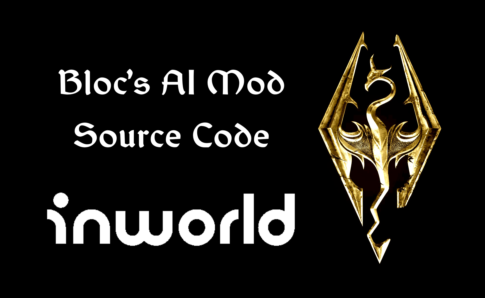

# Inworld Skyrim Mod
Inworld Skyrim Mod Source Code. This is a project that consists of three parts: a SKSE C++ plugin, Papyrus scripts, and a Typescript Node.js project. This mod aims to enhance your Skyrim experience by providing additional features and functionality. Follow the instructions below to set up and use the mod correctly.

## Contents
- [SKSE C++ Plugin](#skse-c-plugin)

- [Papyrus Scripts](#papyrus-scripts)

- [Typescript Node.js Project](#typescript-nodejs-project)

  
## SKSE C++ Plugin
The SKSE (Skyrim Script Extender) C++ plugin is a crucial component of the mod. It extends the scripting capabilities of Skyrim, enabling the mod to function properly.

**Code Location**: `SKSE` folder

This folder includes very amateurly written C++ code. Don't take it as _best practices_, otherwise you would end up as a very very sad person.
To start off, you need to know how to write SKSE mods in C++. I won't go through requirements and details in here. If you need a really good startup-refresher, I **highly** suggest checking instructions provided by SkyrimScripting on her GitHub repository:
[SKSE Hello World Template](https://github.com/SkyrimScripting/SKSE_Template_HelloWorld)

## Papyrus Scripts
The Papyrus scripts are the core of the mod, providing the quests and interactions with the game world.

**Code Location**: `Papyrus` folder

Once again, this code assumes you know how to work with Papyrus. To compile and use the Papyrus scripts, follow these steps:
1. Open the [Skyrim Creation Kit](https://www.creationkit.com/index.php?title=Main_Page).

2. Compile the Papyrus scripts using the Creation Kit.

3. Add the compiled quest to your desired location within the game world.

For more information on working with Papyrus scripts and the Creation Kit, consult the [official documentation](https://www.creationkit.com/index.php?title=Papyrus).

## Typescript Node.js Project
The Typescript Node.js project is responsible for handling the mod's server-side logic.

**Code Location**: `Client` folder

To set it up, follow these steps:

1. Make sure you have [Node.js](https://nodejs.org/en/) installed on your system.

2. Go to .env file and add your credentials and workspace secrets

3. Navigate to the project directory and install the necessary packages using the following command: `npm install`

4. Start the Node.js client by running: `npm start`

The server should now be up and running. First time run might take a while because it will try to create all the characters from the JSON file one by one. This will happen only once and might take around ~4 minutes to set up. 

### Hard Requirements

You need some hard mod requirements to make this run properly as a mod.
You will need the following:
- [UIExtensions](https://www.nexusmods.com/skyrimspecialedition/mods/17561)
- [Skyrim Script Extender](http://skse.silverlock.org/)
- [Address Library for SKSE Plugins](https://www.nexusmods.com/skyrimspecialedition/mods/32444)
- [SkyUI](https://www.nexusmods.com/skyrimspecialedition/mods/12604)
- [iWant Widgets](https://www.nexusmods.com/skyrimspecialedition/mods/36457)

## Adding More Characters
System works in a way that it takes character name and searches that name in created characters before establishing connection. This means, if Ulfric Stormcloak isn't created in Inworld Workplace, then you won't be able to talk with him. What can you do? You can add this character to your list, and then, you will be able to use it. 
You need to go to `Client\Templates\WorldBuilding` folder, find _**SkyrimCharacters.json**_ and add your character to this list. You can create your character on Inworld server, and press `F12` and get JSON from networking tab (to make life easier for you)